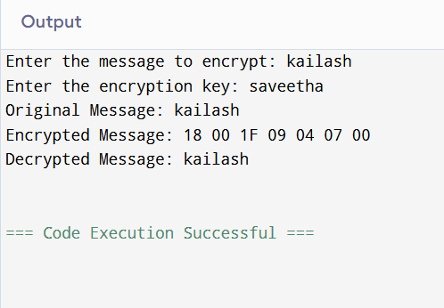

# EX-NO-7-Implement-DES-Encryption-and-Decryption

## Aim:

To use the Data Encryption Standard (DES) algorithm for a practical application, such as securing sensitive data transmission in financial transactions.

## ALGORITHM:

1. DES is based on a symmetric key encryption technique that encrypts data in 64-bit blocks.
2. DES uses a Feistel network structure with 16 rounds of processing for encryption.
3. DES has a 64-bit key, but only 56 bits are used for encryption (the remaining 8 bits are for parity).
4. DES applies initial and final permutations along with 16 rounds of substitution and permutation transformations to produce ciphertext.

## Program:
```C
#include <stdio.h>
#include <string.h>
void encrypt(char *message, char *key, char *encryptedMessage, int messageLength) {
    int keyLength = strlen(key);
    for (int i = 0; i < messageLength; i++) {
        encryptedMessage[i] = message[i] ^ key[i % keyLength];
    }
    encryptedMessage[messageLength] = '\0';  
}
void decrypt(char *encryptedMessage, char *key, char *decryptedMessage, int messageLength) {
    int keyLength = strlen(key);

    for (int i = 0; i < messageLength; i++) {
       
        decryptedMessage[i] = encryptedMessage[i] ^ key[i % keyLength];
    }
    decryptedMessage[messageLength] = '\0'; 
}
int main() {
    char message[100];
    char key[100];
    
    printf("Enter the message to encrypt: ");
    fgets(message, sizeof(message), stdin);
    message[strcspn(message, "\n")] = '\0'; 
    printf("Enter the encryption key: ");
    fgets(key, sizeof(key), stdin);
    key[strcspn(key, "\n")] = '\0';  
    int messageLength = strlen(message);
    char encryptedMessage[100];
    char decryptedMessage[100];
    
    encrypt(message, key, encryptedMessage, messageLength);
    printf("Original Message: %s\n", message);
    printf("Encrypted Message: ");
    
    for (int i = 0; i < messageLength; i++) {
        printf("%02X ", (unsigned char)encryptedMessage[i]);
    }
    printf("\n");
    decrypt(encryptedMessage, key, decryptedMessage, messageLength);
    printf("Decrypted Message: %s\n", decryptedMessage);
    return 0;
}
```

## Output:


## Result:
  The program is executed successfully

